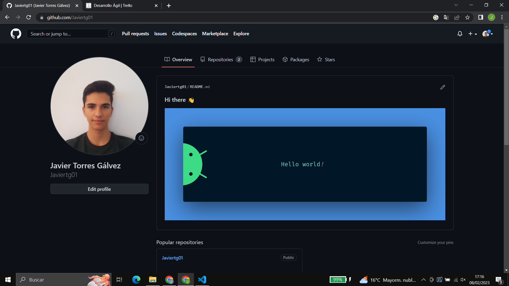
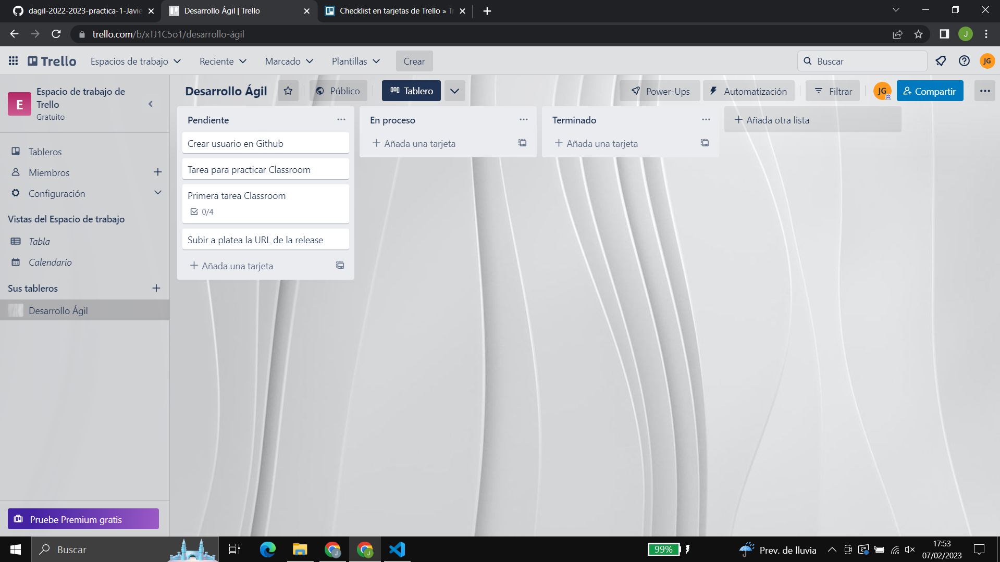
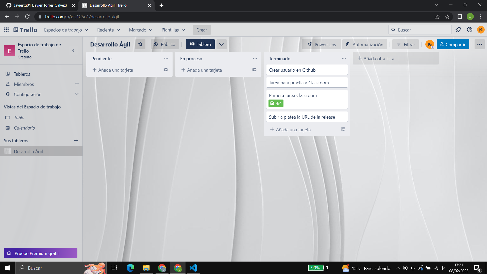

# Plantilla Práctica 1

### Javier Torres Gálvez

Estudiante de Ingeniería Informática de la Universidad de Jaén.
* **Correo**: jtg00023@red.ujaen.es
* **Usuario GitHub**: Javiertg01
* **GitHub**: https://github.com/Javiertg01
* **Captura GitHub Perfil**:

* **Trello**: https://trello.com/invite/b/xTJ1C5o1/ATTI4dd8311c780c6d42d8013c597818902fF926191F/desarrollo-agil
* **Captura Trello Inicial**:

* **Captura Trello Final**:
